# 概述

### .　　这个项目最初的目的是为了尝试解析现有的UI编辑器（MyGUI）导出的UI布局信息，通过ImGUI还原UI渲染。但是在开发过程中，我发现可以借此实现一个编辑器，一个我不断的寻找，但始终没有找到的简单易用容易扩展的几何编辑器。“几何编辑器”这个名字可能不太准确，我也不知道它应该叫什么，我主要用它来实现和验证各种几何相关的图形算法，因为它是个人兴趣所致，所以前后实现的两个功能可能完全没有关联，毕竟我是一个兴趣广泛的人。由于这个编辑器的主要目的并不是实现编辑器本身，而是在它的基础上实现各种几何算法，因此编辑器本身还比较粗糙（其实整体都比较粗糙- -|||）。值得一提的是，这个项目没有引入任何第三方渲染库，底层的渲染管道是基于OpenGL纯手工编码。

### 依赖：
* 编程语言：C++17
* 编译环境：Visual Studio 2019
* 第三方库：GLM，ImGUI，stb_image

### 模块：
* 配置

*Tips：配置的读取和写入，目前仅支持Json格式*

* 资源

*Tips：当前支持图片（.jpg，.png），图集（.atlas），Tilemap地图（.map），着色器（.program），SDF字体（.fnt），可序列化对象。资源管理是基于std::weak_ptr/std::share_ptr实现，尽可能的简单易用。*

* 事件

*Tips：全局事件模块*

* 界面

*Tips：基于ImGUI实现的UI模块，当前已实现控件有：容器框，文本框，输入框，选择框，下拉框，树形框，按钮，菜单，画布。通过UI布局文件自动生成UI对象，统一管理UI事件（包括拖放事件），可动态调整容器大小，支持皮肤更换。其中画布提供了渲染功能，即舞台对象的渲染都将在画布中实现。*

* 组件

*Tips：组件模块和渲染对象都包含在界面中，因为它们都依赖画布，但组件模块占比较高，所以单独提出，它的设计理念可参考Unity3D。*

# 部分功能展示

**换肤**

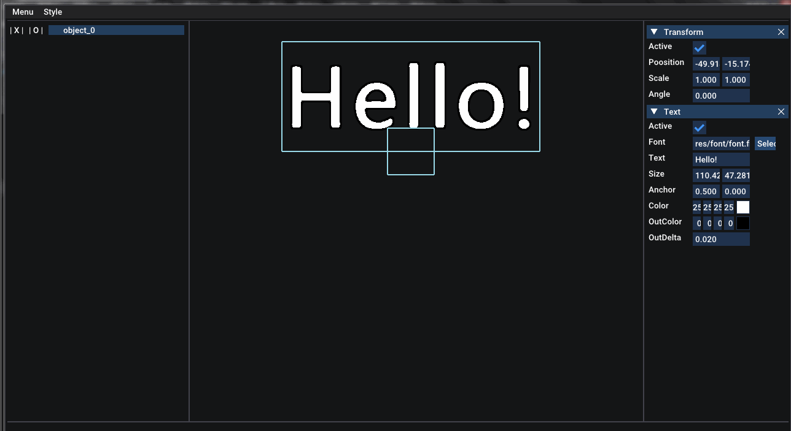

**资源搜索**

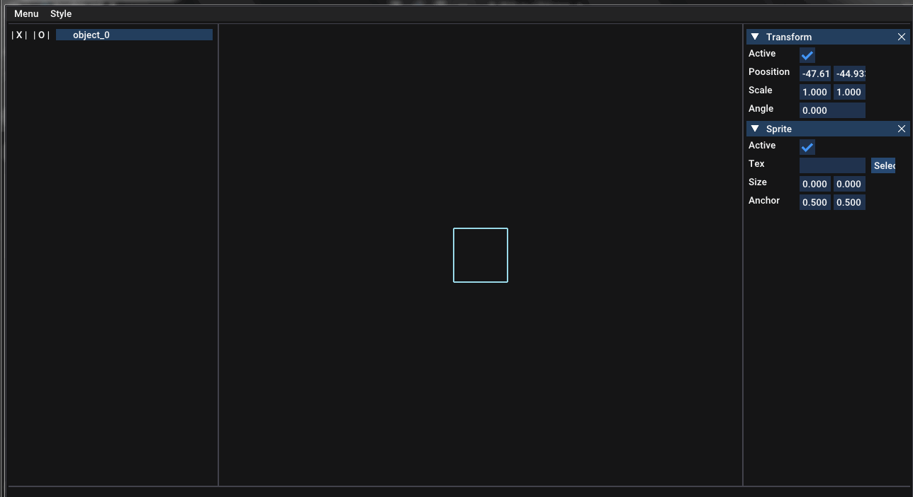

**舞台基本操作**

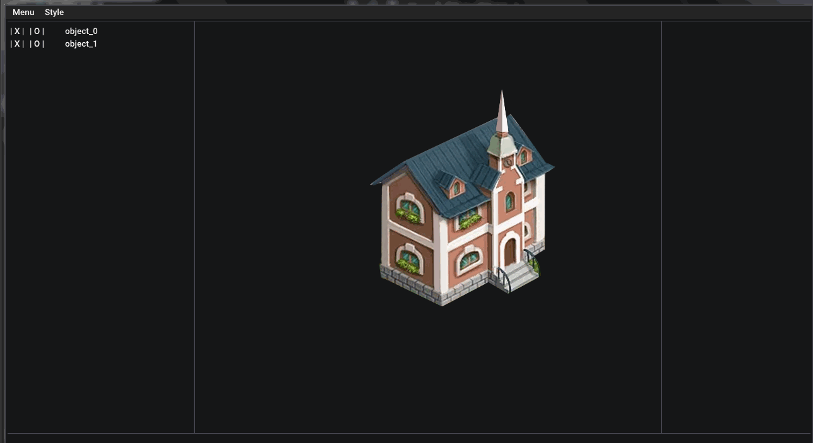

**组件-文本渲染**

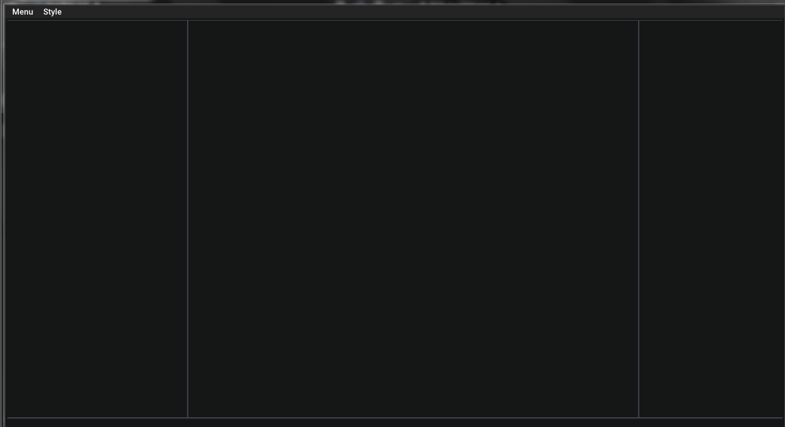

**组件-精灵渲染**

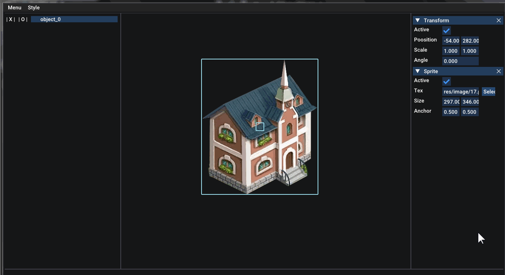

**组件-光源渲染**

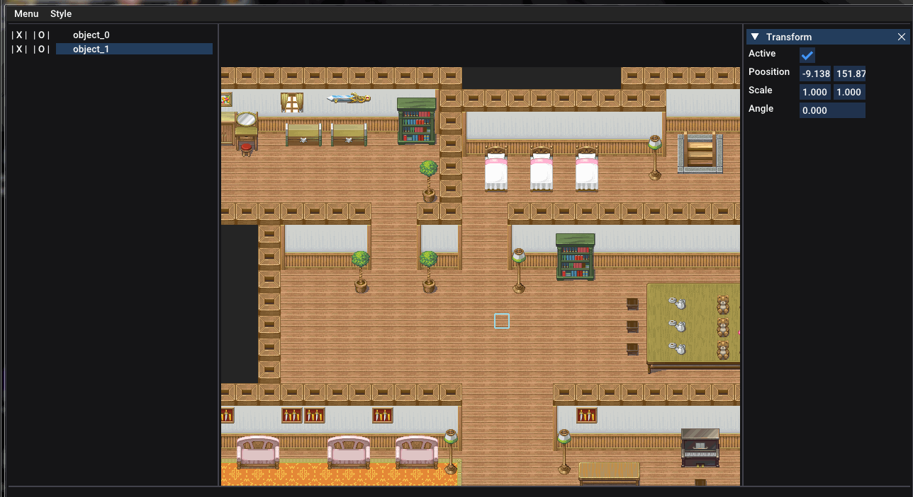

**组件-地图渲染**

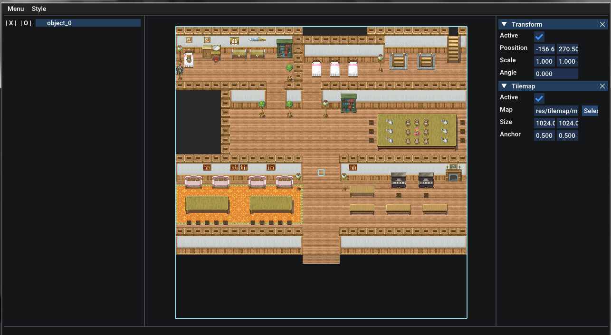

**组件-曲线渲染**

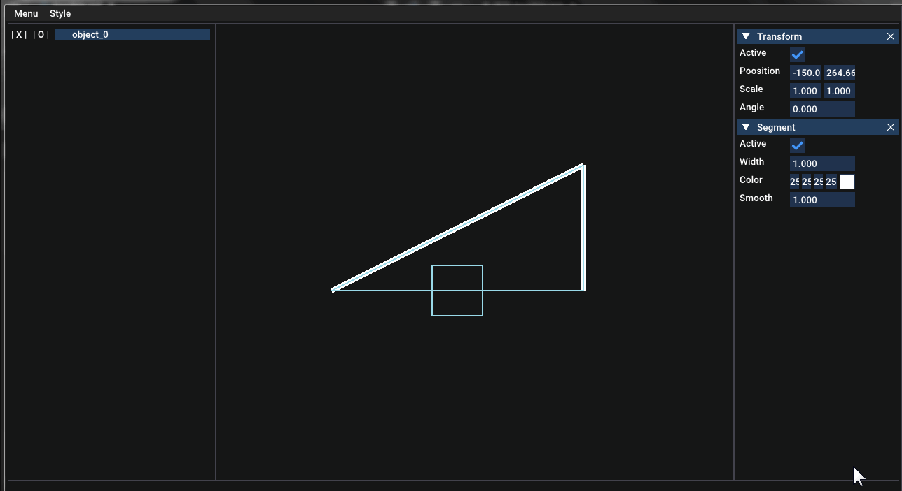

**组件-闪电渲染**

**组件-精灵变形渲染**

**组件-后期处理渲染**

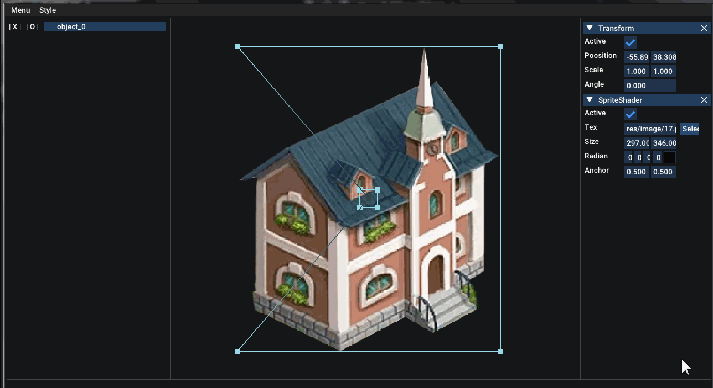

**组件-遮挡剔除渲染**

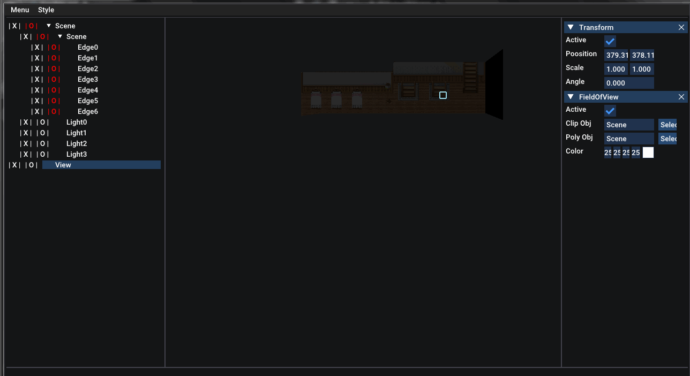

**组件-地形擦出渲染**

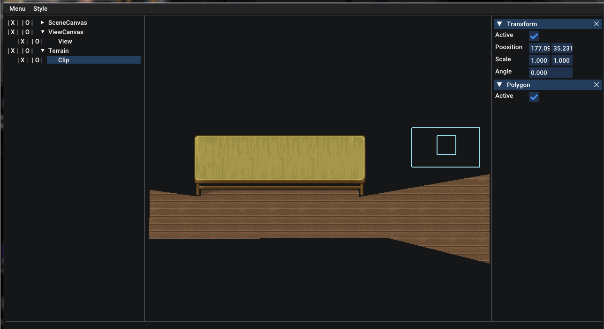

**如果你对某个实现感兴趣，你可以尝试在这里找到相对详细的细节分析（其实也不太详细）>>> [博客：落单的毛毛虫](https://www.cnblogs.com/mmc1206x/)**
