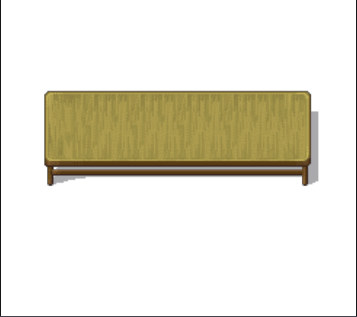
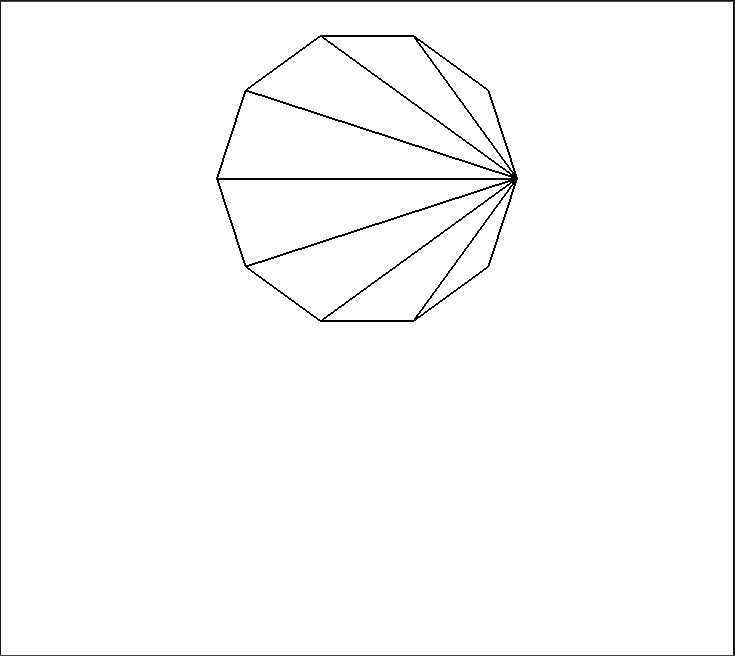
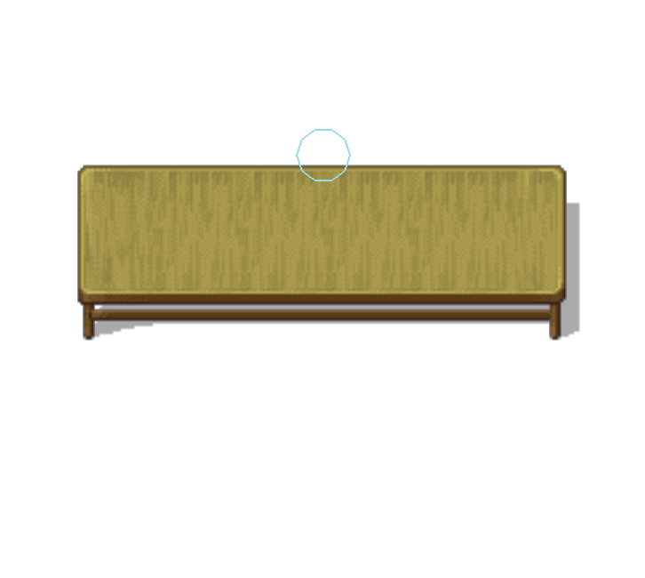
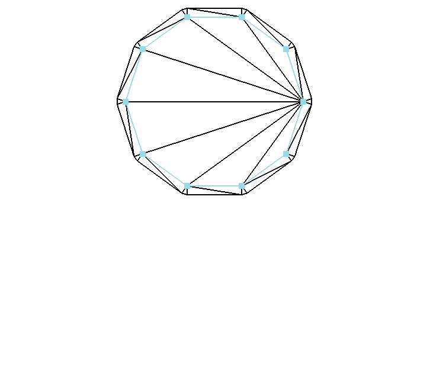
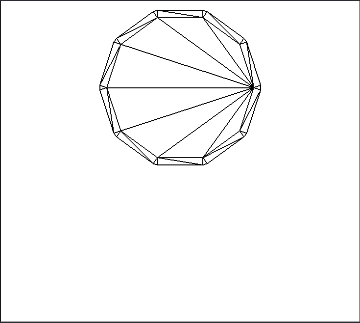
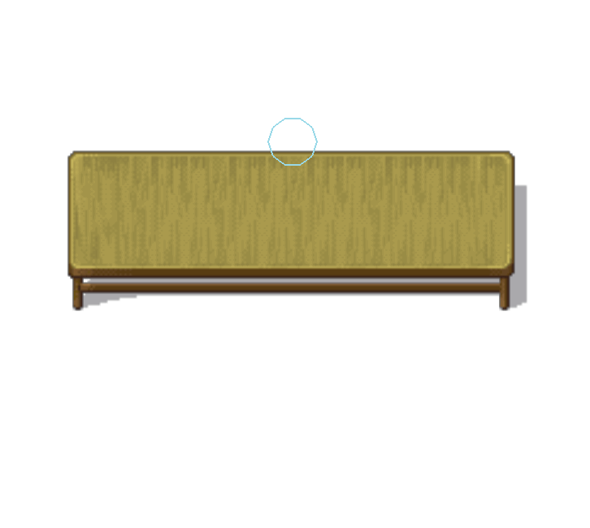
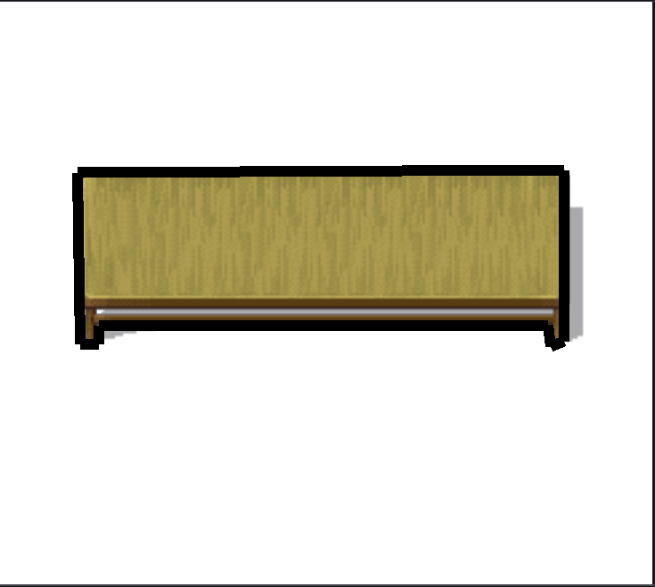
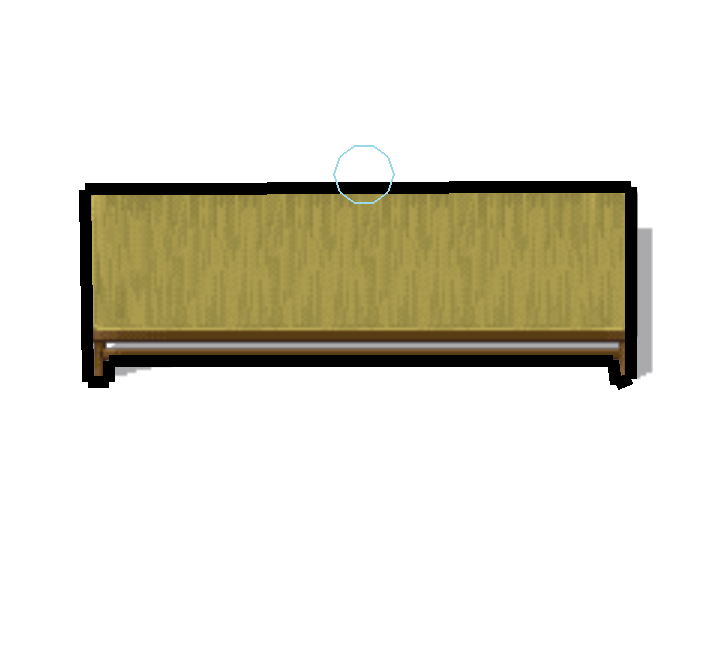
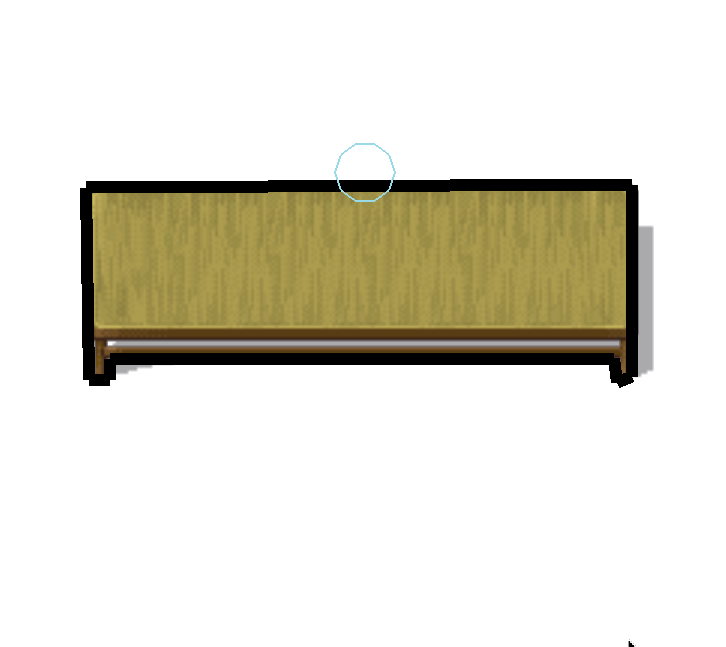
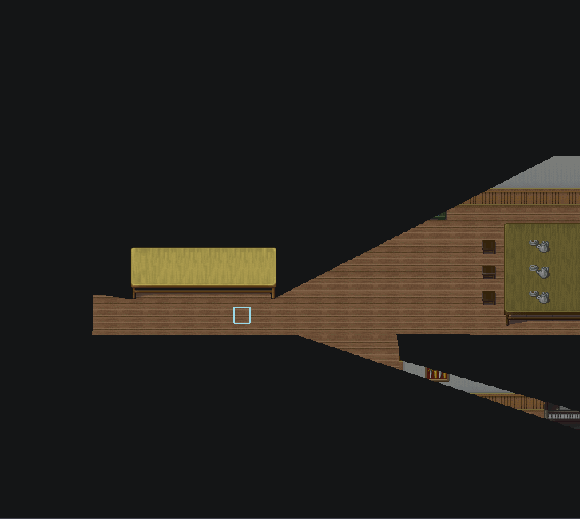

.　　关于2D地图擦除算法，去年我写过一个实现，勉强实现了地形擦除，但跟最终效果还相差甚远，这次我写了一个完整的实现，在此记录，留个印象。

.　　去年的版本[<<算法 & 数据结构——裁剪多边形>>](https://www.jianshu.com/p/bb0e84809ac8)，因为受限于当时框架用GDI实现的渲染器，只有擦除地形没有擦除地图，这次换了OpenGL渲染器，终于可以实现最终效果了。

这个算法看似简单，实际上就是很简单，大致可分为三个部分。

地图擦除：擦除地图的图像，产生视觉效果。

地形擦除：擦除地图的形状，用于物理计算。

橡皮擦：用于定义擦除的形状。

### 地图擦除



假设这是一副画在纸上的彩笔画，如果要擦除画上的一部分，有过生活经验的人立马就能想到用橡皮擦就好了，很多算法灵感来自生活，生活多姿多彩的人适合做程序员。这个实现过程大概就是：绑定地图到当前渲染目标，渲染“橡皮擦”让其覆盖范围内的像素，从而达到擦除效果。

### 橡皮擦
接着上一个环节，“橡皮擦”可以是从文件读取的一张图，也可以是程序生成的一张图。如果从文件读取，设置合适的BlendFunc，直接渲染覆盖像素颜色就行了，本例使用程序生成的图，因为这个灵活度更高。



这是一个正10边形的“橡皮擦”，从图中可看出，里面有几条线，把正10边形分割成了8个三角形，这8把三角形的面积和形状等于这个正10边形，如果你困惑为什么要切成三角形，你运气很好，有一个大佬刚好知道你的困惑，并为你量身定做了一篇答案[<<算法 & 数据结构——任意多边形填充>>](https://www.cnblogs.com/mmc1206x/p/11058795.html)。



以上则是地图的擦除效果，其中有一处细节，擦除的边缘有点生硬，如果要制作类似《弹弹堂》这样的游戏，地图是通过炮弹炸掉的，那么被擦除的边缘应该留下被炸过的痕迹，不用做的太真实，只要让边缘产生一些不一样的渐变色就行了，要实现这一点，只需扩展一下“橡皮擦”的边缘。

拆分三角网格，用于渲染。



柔滑边缘，用于生成描边。



柔滑边缘后的擦除效果。




### 地形擦除

这是最棘手的一个环节。



以上是一张加了地形的图，你没有看错，就只是多了一个黑边。

现在要通过“橡皮擦”擦除这个黑边，与地图擦除不同的是，地图擦除直接覆盖像素就行了，而地形不光是擦除，还要计算出被擦除后正确的形状，除此之外，还要考虑浮点运算的误差，总之，只有代码能才解释这段逻辑。





```C++
auto CompCollapseTerrain::GenClipNums(const Clip & clip) -> ClipNums
{
    ClipNums result;
    auto clip2=clip;
    for (auto & area : mAreas)
    {
        if (UpdateClip(area, clip2))
        {
            auto cps = GenClipPoint(area,clip2);
            result.emplace_back(cps.size() / 2);
        }
        else
        {
            result.emplace_back(0);
        }
    }
    return std::move(result);
}

auto CompCollapseTerrain::GenClipLine(const Clip & clip, const ClipPoint & cp0, const ClipPoint & cp1) -> ClipLine
{
    ClipLine result;
    result.mAreaEnd0 = cp0.mAreaIdx1;
    result.mAreaEnd1 = cp1.mAreaIdx1;

    result.mLine.emplace_back(glm::lerp(clip.at(cp0.mClipIdx0), clip.at(cp0.mClipIdx1), cp0.mClipCross));
    for (auto i = cp0.mClipIdx1; 
             i != cp1.mClipIdx1; 
             i  = (i + 1) % clip.size())
    {
        result.mLine.emplace_back(clip.at(i));
    }
    result.mLine.emplace_back(glm::lerp(clip.at(cp1.mClipIdx0), clip.at(cp1.mClipIdx1), cp1.mClipCross));

    if (cp0.mAreaIdx1 == cp1.mAreaIdx1 && cp0.mAreaCross < cp1.mAreaCross)
    {
        std::reverse(result.mLine.begin(), result.mLine.end());
    }
    return std::move(result);
}

auto CompCollapseTerrain::GenClipPoint(const Area & area, const Clip & clip, bool onlyone) -> std::vector<ClipPoint>
{
    using Cross = std::tuple<uint, uint, float, float>;
    std::vector<ClipPoint>  results;
    std::vector<Cross>      cross;
    for (auto i = 0u, size = clip.size(); i != size; ++i)
    {
        cross.clear();
        auto j = (i + 1) % size;
        auto & a = clip.at(i);
        auto & b = clip.at(j);
        ASSERT_LOG(a != b,"");
        if (tools::IsCrossSegment(a, b, area, &cross))
        {
            std::sort(cross.begin(), cross.end(), [] (const auto & a, const auto & b)
                {
                    return std::get<3>(a) < std::get<3>(b);
                });

            for (auto k = 0; k != cross.size(); ++k)
            {
                auto ok = (results.size() & 1) != 0;
                if (!ok && (cross.size() == 1 + k || cross.size() == 1))
                {
                    ok = tools::IsContains(area, b, false);
                }
                if (!ok && (cross.size() != 1 + k))
                {
                    const auto & curr = cross.at(k);
                    const auto & next = cross.at(k + 1);
                    auto p0 = area.at(std::get<0>(curr));
                    auto p1 = area.at(std::get<1>(curr));
                    auto p2 = area.at(std::get<0>(next));
                    auto p3 = area.at(std::get<1>(next));
                    auto v0 = glm::lerp(p0, p1, std::get<2>(curr));
                    auto v1 = glm::lerp(p2, p3, std::get<2>(next));
                    ok = tools::DistanceSqrt(p0, v0) > 1 && tools::DistanceSqrt(p1, v0) > 1 ||
                         tools::DistanceSqrt(p2, v1) > 1 && tools::DistanceSqrt(p3, v1) > 1;
                }
                if (ok)
                {
                    results.emplace_back(
                        std::get<0>(cross.at(k)),
                        std::get<1>(cross.at(k)),
                        std::get<2>(cross.at(k)),
                        i, j, std::get<3>(cross.at(k)));
                }
                if (onlyone && results.size() == 2) { break; }
            }
        }
        if (onlyone && results.size() == 2) { break; }
    }
    return std::move(results);
}

void CompCollapseTerrain::BinaryPoints(const Area & area, const Clip & clip, const ClipLine & clipLine, std::vector<glm::vec2> * output)
{
    auto size = area.size();
    for (auto i = clipLine.mAreaEnd0;
        clipLine.mAreaEnd1 != i ||
        output[0].empty();
        i = (i +1) % size)
    {
        output[0].emplace_back(area.at(i));
    }
    std::copy(clipLine.mLine.rbegin(), clipLine.mLine.rend(), std::back_inserter(output[0]));

    for (auto i = clipLine.mAreaEnd1; 
        clipLine.mAreaEnd0 != clipLine.mAreaEnd1 &&
        clipLine.mAreaEnd0 != i; i = (i + 1) % size)
    {
        output[1].emplace_back(area.at(i));
    }
    std::copy(clipLine.mLine.begin(), clipLine.mLine.end(), std::back_inserter(output[1]));
}

bool CompCollapseTerrain::UpdateClip(const Area & area, Clip & clip)
{
    auto it = std::find_if(clip.begin(), clip.end(), [&] (const glm::vec2 & point)
        {
            return !tools::IsContains(area, point);
        });
    if (it != clip.end())
    {
        std::rotate(clip.begin(), it, clip.end());
    }
    return it != clip.end();
}

void CompCollapseTerrain::HandleClip(const Clip & clip, const std::vector<Area> & input, std::vector<Area> & output)
{
    Area binary[2];
    for (auto & area : input)
    {
        auto cps = GenClipPoint(area, clip, true);
        if (cps.empty())
        {
            output.emplace_back(area);
        }
        else
        {
            ASSERT_LOG(cps.size() != 1, "");
            auto & p0 = cps.at(0);
            auto & p1 = cps.at(1);
            auto clipLine = GenClipLine(clip, p0, p1);
            BinaryPoints(area, clip, clipLine,binary);
            if (!IsContains(clip, binary[0]))
            {
                output.emplace_back(std::move(binary[0]));
            }
            if (!IsContains(clip, binary[1]))
            {
                output.emplace_back(std::move(binary[1]));
            }
        }
    }
}

void CompCollapseTerrain::HandleClip(const Clip & clip)
{
    auto clipNums = GenClipNums(clip);
    std::vector<Clip> buffers[2];
    auto clip2            = clip;
    for (auto i = 0; i != clipNums.size(); ++i)
    {
        buffers[0].clear();
        buffers[1].clear();
        buffers[0].emplace_back(std::move(mAreas.at(i)));
        if (UpdateClip(buffers[0].front(), clip2))
        {
            for (auto j = 0; j != clipNums.at(i); ++j)
            {
                HandleClip(clip2, buffers[0], buffers[1]);
                buffers[0]        = std::move(buffers[1]);
            }
            if (clipNums.at(i) == 0 && IsContains(clip, buffers[0].front()))
            {
                buffers[0].clear();
            }
        }
        mAreas.insert(mAreas.end(), buffers[0].begin(), buffers[0].end());
    }
    mAreas.erase(mAreas.begin(), mAreas.begin() + clipNums.size());
}

bool CompCollapseTerrain::IsContains(const std::vector<glm::vec2> & points0, const std::vector<glm::vec2> & points1)
{
    //  顶点是否在边附近
    for (auto & p : points1)
    {
        auto pass = true;
        auto size = points0.size();
        for (auto i = 0; i != size; ++i)
        {
            auto j = (i + 1) % size;
            auto & a = points0.at(i);
            auto & b = points0.at(j);
            auto [cross, diff] = tools::Distance(a, b, p);
            if (glm::length_sqrt(diff)<10) { pass=false; }
        }
        if (pass && !tools::IsContains(points0, p)) { return false; }
    }
    return true;
}
```


